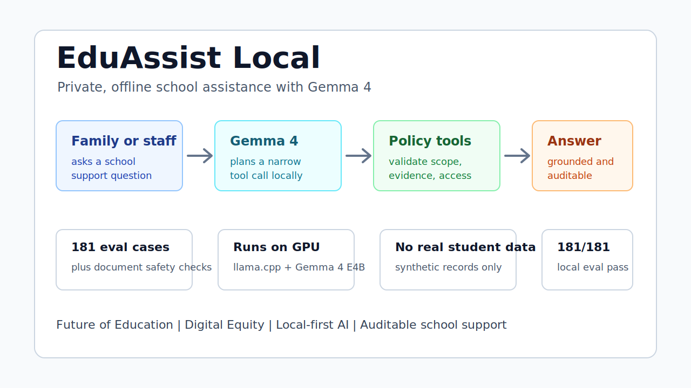

# EduAssist Local for Gemma 4 Good

EduAssist Local is a Gemma 4 Good hackathon fork of the EduAssist school service
platform. It demonstrates a local-first assistant for schools and families in
low-connectivity contexts, using Gemma 4 as the central reasoning and response
engine while deterministic tools enforce access control and evidence grounding.

This repository is intentionally smaller than the source EduAssist platform. It
contains only synthetic data, a demo app, a local Gemma 4 runtime recipe, and the
submission writeup assets needed for a public hackathon repo.



## Why this project

Schools often need to answer operational and student-support questions without
depending on a cloud LLM for every private interaction. EduAssist Local shows a
privacy-preserving flow:

1. A family member or school staff user asks a question.
2. Gemma 4 proposes a narrow tool plan.
3. The application validates the requested tool call and access scope.
4. Deterministic tools retrieve public policy documents or synthetic protected
   student snapshots.
5. Gemma 4 writes the final answer using only validated evidence.
6. The UI exposes the tool trace, evidence, and access decision for auditability.

The result is not a generic chatbot. It is a local, auditable school assistance
workflow aimed at Digital Equity and Future of Education.

## Gemma 4 usage

The demo is built around Gemma 4 E4B running locally through llama.cpp with an
OpenAI-compatible HTTP API. The app uses Gemma in two places:

- tool planning: pick from a small, validated set of school-assistance tools;
- grounded composition: generate the final answer from retrieved evidence and
  policy decisions.

If the local model is unavailable, the app falls back to a deterministic planner
and composer so judges can still inspect the product flow. The intended
submission demo should run with the local Gemma service enabled.

Official references used for this design:

- Kaggle challenge: https://www.kaggle.com/competitions/gemma-4-good-hackathon
- Gemma 4 launch: https://blog.google/innovation-and-ai/technology/developers-tools/gemma-4/
- Gemma model card: https://ai.google.dev/gemma/docs/model_card
- Gemma function calling guide: https://ai.google.dev/gemma/docs/capabilities/function-calling

## Quick start

Install Python dependencies with uv:

```bash
uv sync --dev
```

Start the demo app without a model, using the deterministic fallback:

```bash
uv run streamlit run src/eduassist_gemma_good/app.py
```

Start the local Gemma 4 E4B service:

```bash
cp .env.example .env
make llm-up
```

The first run builds the CUDA-enabled llama.cpp image and downloads
`gemma-4-E4B-it-Q4_K_M.gguf` from `ggml-org/gemma-4-E4B-it-GGUF`, so it can take
several minutes. Later runs reuse the Docker image and Hugging Face cache.

Then run the app with Gemma enabled:

```bash
make app
```

Open http://localhost:8501.

The app includes `Demo scenario` and `Prepared question` selectors populated
from the same 24-question regression set used by `make eval`. Choosing a
prepared question loads the matching persona and expected tool/access outcome,
while still leaving the question text editable for live exploration.

## Evaluation

Run the fast offline evaluation:

```bash
make eval
```

Run the same evaluation with local Gemma calls:

```bash
uv run python -m eduassist_gemma_good.eval_runner --use-llm
```

Reports are written to `artifacts/eval_report.json` and
`artifacts/eval_report.md`.

Current local validation:

- Gemma runtime: `ggml-org/gemma-4-E4B-it-GGUF`, file
  `gemma-4-E4B-it-Q4_K_M.gguf`;
- hardware smoke: NVIDIA GeForce RTX 4070 Laptop GPU, 8 GB VRAM;
- CUDA offload confirmed by llama.cpp logs: `offloaded 43/43 layers to GPU`;
- generation-time GPU utilization observed at 86-92% with about 4.6 GB VRAM in
  use;
- Gemma-enabled evaluation: 24/24 passed, pass rate 1.0.

## Repository map

- `src/eduassist_gemma_good/` - demo app and local-first assistant engine.
- `data/demo/public/` - synthetic public school documents.
- `data/demo/protected/` - synthetic protected student snapshots.
- `data/demo/evals/` - small evaluation set for demo regression checks.
- `infra/compose/` - local Gemma 4 E4B service and optional demo-web service.
- `docs/submission/` - hackathon writeup, demo script, evaluation plan, and
  implementation status.
- `docs/submission/kaggle-submission.md` - title, summary, writeup, links, and
  final checklist for the Kaggle form.

## Safety posture

- No real student data is stored here.
- Model calls never access a database directly.
- Tools are explicit, narrow, and validated before execution.
- Protected answers are denied unless the selected persona has scope.
- The final answer is instructed to use only retrieved evidence.
