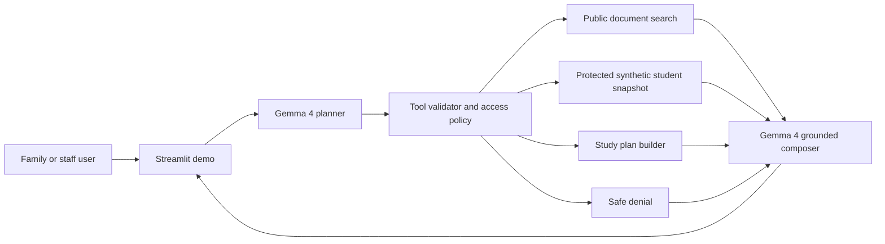

# Technical Writeup

## Project

EduAssist Local is a local-first school assistance workflow for families and
school staff. It targets schools that need useful AI support while preserving
student privacy, working during unreliable connectivity, and keeping protected
data behind deterministic access controls.

## Impact area

The project fits Future of Education and Digital Equity:

- families can understand school procedures in plain language;
- guardians can receive synthetic private student support summaries only after
  authorization;
- schools can run the core assistant locally instead of sending every protected
  question to a cloud model;
- the interface exposes evidence and tool traces so users can see why an answer
  was produced.

## Architecture

The repository uses a deliberately small tool surface. Gemma 4 can propose a
tool call, but the Python application validates names, arguments, and persona
scope before execution. Protected data is never exposed directly to the model
unless the deterministic policy layer approves it for the selected persona.

## How Gemma 4 is used

Gemma 4 E4B is served locally through llama.cpp and an OpenAI-compatible HTTP
API. The application uses it in two stages:

1. Tool planning. Gemma receives the question, persona, authorized synthetic
   student ids, and the allowed tool schemas. It returns a compact JSON plan.
2. Grounded composition. Gemma receives only validated tool results and writes
   the final answer. The prompt forbids revealing protected data after denials
   and asks for concise answers grounded in evidence.

This matches the Gemma 4 design strengths documented by Google: local/edge
deployment, native system prompts, long context, multilingual behavior,
structured output, and function-calling style workflows.

Local validation on April 24, 2026 used the Q4_K_M GGUF artifact from
`ggml-org/gemma-4-E4B-it-GGUF` on an NVIDIA GeForce RTX 4070 Laptop GPU. The
llama.cpp runtime reported `offloaded 43/43 layers to GPU`, `CUDA0` model, KV,
and compute buffers, and generation-time `nvidia-smi` samples showed 86-92% GPU
utilization with about 4.6 GB VRAM in use. The expanded offline regression
suite now passes 181/181 cases, including public questions, authorized protected
support, privacy denials, document intake, Portuguese prompts, and malicious
notice text. A representative Gemma-enabled subset passed 3/3 across public
information, authorized support, and privacy guardrail cases.

## Safety and privacy

- The demo contains synthetic data only.
- The model never receives unrestricted database access.
- Tool execution is mapped by explicit Python functions, not dynamic globals.
- Student snapshots require an authorized persona.
- Unauthorized requests return a denial result, which the composer must respect.
- The UI displays access decisions, tool calls, and evidence.

## Current limitations

- The Streamlit app is a hackathon demo, not a production identity system.
- The protected dataset is synthetic and intentionally small.
- Local model latency depends on GPU, quantization, and first-load time.
- The fallback mode exists only to make the demo inspectable without model
  weights. The intended submission run uses local Gemma 4.

## Why this is a fork

The source EduAssist platform includes Telegram, Keycloak, Postgres, Qdrant,
observability, and multiple orchestration paths. For a public hackathon repo,
that is too much surface area. This fork keeps the strongest idea, local Gemma
reasoning with deterministic school-data tools, and removes production-specific
complexity.
