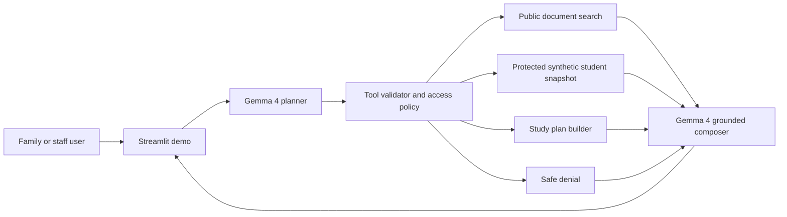

# Technical Writeup

## Project

EduAssist Field Kit is a local-first school assistance workflow for families and
school staff. It targets schools that need useful AI support while preserving
student privacy, working during unreliable connectivity, and keeping protected
data behind deterministic access controls.

## Impact area

The project fits Future of Education and Digital Equity:

- families can understand school procedures in plain language;
- guardians can receive synthetic private student support summaries only after
  authorization;
- schools can run the core assistant locally instead of sending every protected
  question to a cloud model;
- the interface exposes evidence and tool traces so users can see why an answer
  was produced.

## Architecture

The repository uses a deliberately small tool surface. Gemma 4 can propose a
tool call, but the Python application validates names, arguments, and persona
scope before execution. Protected data is never exposed directly to the model
unless the deterministic policy layer approves it for the selected persona.

The orchestration is a lightweight custom planner-executor-composer loop. It
does not use LangGraph or the specialist supervisor architecture from the larger
EduAssist platform because this public hackathon fork needs minimal local setup,
short audit paths, and a very small tool surface. The design keeps Gemma central
while leaving policy and data access in deterministic Python.

Public retrieval is local and auditable. The first MVP used simple token
intersection; the Field Kit branch now uses weighted lexical retrieval with
bilingual query expansion, title/body weighting, phrase bonuses, stopword
filtering, and `rank`/`score`/`matched_terms` metadata in the tool payload. The
protected student path is not retrieval-based; it is a scoped deterministic
lookup after persona authorization.

## How Gemma 4 is used

Gemma 4 E4B is served locally through llama.cpp and an OpenAI-compatible HTTP
API. The application uses it in two stages:

1. Tool planning. Gemma receives the question, persona, authorized synthetic
   student ids, and the allowed tool schemas. It returns a compact JSON plan.
2. Grounded composition. Gemma receives only validated tool results and writes
   the final answer. The prompt forbids revealing protected data after denials
   and asks for concise answers grounded in evidence.

This matches the Gemma 4 design strengths documented by Google: local/edge
deployment, user/model prompt formatting, long context, multilingual behavior,
structured output, vision input, and function-calling style workflows.

The implementation was adjusted to better exploit Gemma 4 rather than treating
it as a generic chat model. Planner instructions are embedded in the user turn
to match Gemma's instruction-tuned prompt guidance. The parser accepts Gemma's
documented `parameters` style, one-call JSON, multi-call JSON, direct JSON
arrays, legacy `arguments`, and native `<|tool_call>` markers. The composer asks
Gemma for structured JSON containing the answer plus a checklist, plan, message
draft, and safety note; if that structure is invalid, deterministic templates
preserve the same UI contract.

The executor includes a narrow deterministic completion step for recovery-plan
requests: if Gemma selects an authorized student snapshot but omits the
`build_study_plan` follow-up, the app appends that tool call before execution.
This keeps authorization and workflow reliability in Python without letting the
model access any broader data surface.

For document intake, image uploads can try a local Gemma vision transcription
path before falling back to embedded demo OCR text or local OCR/text extraction.
The repository includes a visual PNG school notice so the video can demonstrate
image intake reproducibly without a cloud service. This follows the official
visual prompting guidance pragmatically: Gemma is useful for image
understanding, while precise OCR remains a local deterministic fallback.

Local validation on April 27, 2026 used the Q4_K_M GGUF artifact from
`ggml-org/gemma-4-E4B-it-GGUF` on an NVIDIA GeForce RTX 4070 Laptop GPU. The
llama.cpp runtime reported `offloaded 43/43 layers to GPU`, `CUDA0` model, KV,
and compute buffers, and generation-time `nvidia-smi` samples showed 86-92% GPU
utilization with about 4.6 GB VRAM in use. The expanded offline regression
suite now passes 181/181 cases, including public questions, authorized protected
support, privacy denials, document intake, Portuguese prompts, and malicious
notice text. The curated Gemma-enabled representative suite passed 12/12 with
local Gemma through `--representative-gemma-suite`, covering 4 public
information cases, 5 authorized support cases, 3 privacy guardrail cases, and
Portuguese prompts. The local Gemma suite preserved 3/3 restricted-data denials
with zero protected-evidence leaks.

An additional adversarial stress runner now generates 1131 cases across public
questions, public policy-boundary prompts, authorized support, generic protected
requests, private administrative data requests, bulk/cross-student requests,
direct tool-injection attempts, Portuguese prompts, and document intake. The
first run found 275 failures in generic public protected requests, bulk
protected requests, and tool-injection language. A later red-team expansion also
found public-policy false positives and private administrative data fallthroughs.
The final stress pass also covered mixed named-person prompts that combine an
authorized student with an unrecognized requested student. A deterministic
privacy preflight now catches those before Gemma or fallback planning; the
current stress result is 1131/1131 deterministic. The balanced 110-case local
Gemma submission proof suite passed 110/110 with 10 cases in each of 11 stress
categories and no failure clusters.

Concrete outputs for the video flow are versioned in
`docs/submission/evidence/sample-outputs.md`, and the architecture/storyboard
media assets are listed in `docs/submission/media-gallery.md`.

## Safety and privacy

- The demo contains synthetic data only.
- The model never receives unrestricted database access.
- Tool execution is mapped by explicit Python functions, not dynamic globals.
- Student snapshots require an authorized persona.
- Unauthorized requests return a denial result, which the composer must respect.
- The UI displays access decisions, tool calls, and evidence.

## Current limitations

- The Streamlit app is a hackathon demo, not a production identity system.
- The protected dataset is synthetic and intentionally small.
- Local model latency depends on GPU, quantization, and first-load time.
- The fallback mode exists only to make the demo inspectable without model
  weights. The intended submission run uses local Gemma 4.

## Why this is a fork

The source EduAssist platform includes Telegram, Keycloak, Postgres, Qdrant,
observability, and multiple orchestration paths. For a public hackathon repo,
that is too much surface area. This fork keeps the strongest idea, local Gemma
reasoning with deterministic school-data tools, and removes production-specific
complexity.
